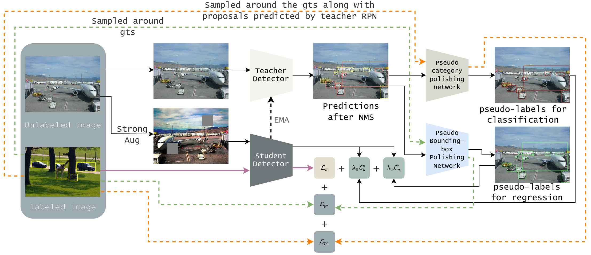

# DualPolishLearning

By Lei Zhang, Yuxuan Sun, Wei Wei

This repo is the official implementation of AAAI2023 paper ["Mind the Gap: Polishing Pseudo labels for Accurate Semi-supervised Object Detection"](https://arxiv.org/abs/2207.08185) on PyTorch.

The code is based on MMdetection Toolbox and Soft Teacher[2].

## Results

### COCO

#### 1% labeled data
| Method | mAP| Model Weights |Config Files|
| :----: | -------| ----- |----|
| Baseline|  10.0 |-|[Config](configs/coco/coco_base.py)|
| Ours    | 23.80 |-|[Config](configs/coco/coco_part.py)|

#### 5% labeled data
| Method | mAP| Model Weights |Config Files|
| :----: | -------| ----- |----|
| Baseline| 10.00 |-|[Config](configs/coco/coco_base.py)|
| Ours    | 32.15 |-|[Config](configs/coco/coco_part.py)|

#### 10% labeled data
| Method | mAP| Model Weights |Config Files|
| :----: | -------| ----- |----|
| Baseline| 20.92 |-|[Config](configs/coco/coco_base.py)|
| Ours    | 35.30 |-|[Config](configs/coco/coco_part.py)|

### VOC

| Method | mAP | AP50 | Model Weights |Config Files|
| :----: | -------| ----- |----|----|
| Baseline| 43.00 | 76.70 |-|[Config](configs/voc/voc07_base.py)|
| Ours    | 52.40 | 82.50 |-|[Config](configs/voc/voc07_rf12.py)|

## Usage

### Data Preparation

### Training

## Installation

[1] [A Simple Semi-Supervised Learning Framework for Object Detection](https://arxiv.org/pdf/2005.04757.pdf)

[2] [End-to-end semi-supervised object detection with soft teacher](https://openaccess.thecvf.com/content/ICCV2021/papers/Xu_End-to-End_Semi-Supervised_Object_Detection_With_Soft_Teacher_ICCV_2021_paper.pdf)
